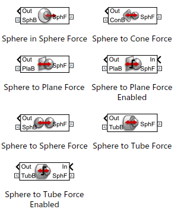
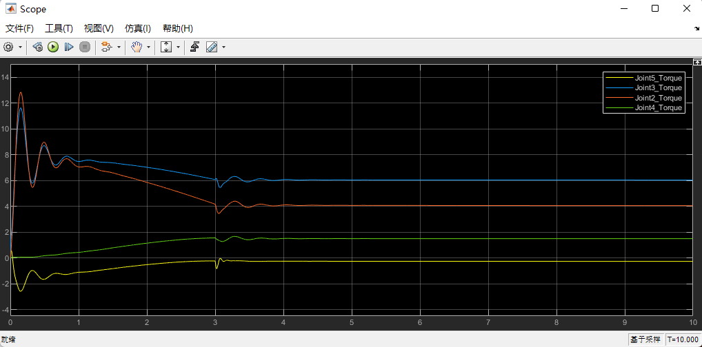
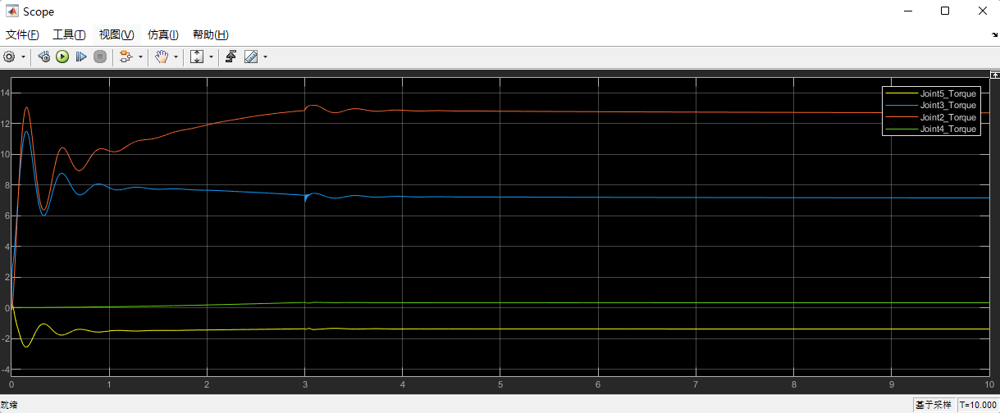
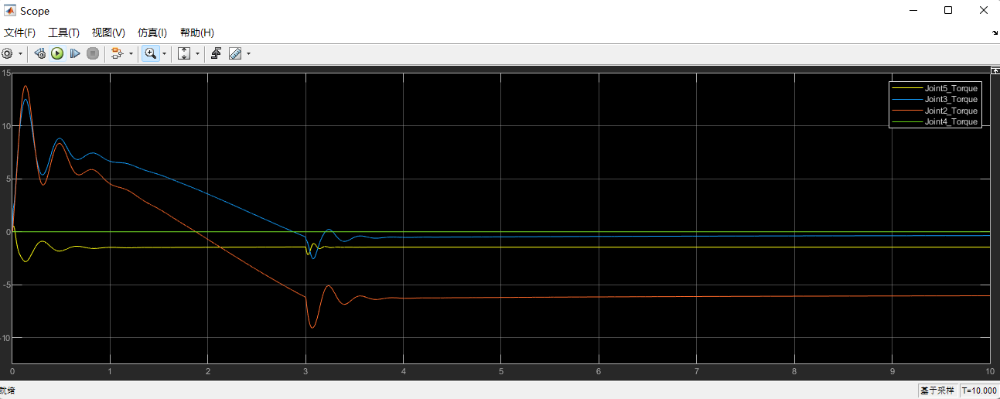
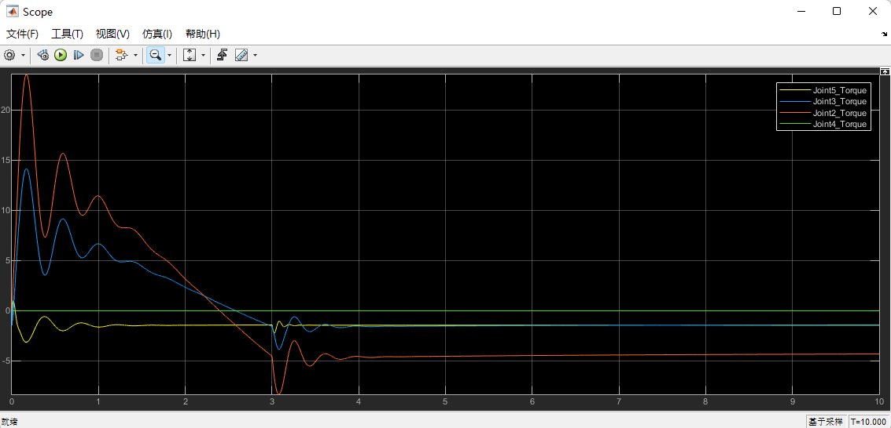

# 六轴机械臂仿真

## 1	简介

- 在六轴机械臂的研发中，需要对机械臂关节电机的力矩进行选型。在绘制出简要的机械模型后，基于`Simulink/Simscape`进行模型仿真，根据关节力矩对电机/减速器进行选型
- 本次仿真有较大的局限性：
  - 逆运动学解算与`Simscape Multibody`仿真分离
  - 单次仿真步长为`0.001s`，仿真总时间为10s，并未做到循环仿真
  - 控制器为简单的`双环PID`，参数未细调

- 仿真模型与结果仅供参考

## 2	文件结构

```
.\
│  CMakeLists.txt				#cmake文件
│  package.xml					#包依赖说明文件
│  robot_show.m					#导入并显示机器人模型，输入目标点坐标-姿态
│  robot_hand_SLDASM.slxc		#Simulink缓存包
│  ikSolver.slxc				#Simulink缓存包
│  ikSolver.slx					#逆运动学解算-simulink
│  robot_hand_SLDASM.slx		#仿真模型-simulink
│
├─config  						#配置文件-ROS
├─launch						#launch文件-ROS
├─meshes						#模型材料/颜色说明
├─urdf							#urdf模型文件夹
├─textures
├─image							#image in docA
├─CFL_Core						#Matlab附加功能：Simscape Contact Force Library
└─slprj							#CFL工程文件夹

```

`slprj`文件夹说明：[`slprj folder`]([slprj文件夹 – MATLAB中文论坛 (ilovematlab.cn)](https://www.ilovematlab.cn/thread-214871-1-1.html))

## 3	环境配置

### Matlab Simscape Contact Force Library安装

Matlab Simscape Contact Force Library 库是Matlab中的附加功能，在Simscape Multibody仿真中定义物体之间的碰撞力，该库目前对于3D仿真只支持以下几种模型，因此并不能完全定义物体的任一表面，因此在仿真时可对其进行简化。[MathWorks文档](https://ww2.mathworks.cn/matlabcentral/fileexchange/47417-simscape-multibody-contact-forces-library?s_tid=srchtitle)



在Matlab Simscape Contact Force Library中选择对应Matlab的版本（本次仿真为R2022a）进行下载，将解压后文件夹中的`CFL_Core`文件夹放入工作空间中即可使用。

除此之外Matlab所下载的附加功能包默认存放在`C:\Users\UserName\AppData\Roaming\MathWorks\MATLAB Add-Ons\Collections`当中

### 其他安装

- Simulink/Simscape
- Simscape Multibody
- Robotic System Toolbox

## 4	仿真说明

### 仿真运行

运行仿真的文件为`./IkSolver.slx`,`./robot_hand_SLDASM.slx`以及`robot_show.m`文件

- 首先运行`robot_show.m`文件，输入你期望达到的末端坐标`[x,y,z]`（姿态同样可以进行给定，由于末端坐标系与世界坐标系在初始位置并非重合，因此设为定值），如需要可在程序中进行修改。同时该段程序会将solidworks生成的urdf模型导入Matlab并且在三维坐标系中显示出来。
- 在`robot_show.m`文件中，会在导入机器人模型后，根据所输入的坐标进行逆运动学解算，程序中会自主运行`ikSolver.slx`的Simulink文件，将逆运动学得到的结果存储在工作空间的`Configs`变量中。该变量的属性为`Timeseries`，可在工作空间打开查看，使用`Configs.Data`来对数据进行索引。
- 最终运行`robot_hand_SLDASM.slx`的Simulink文件，将会进行仿真，仿真时间为10s，仿真步长为0.001s
- 仿真模型的起始位置为上一次运行`robot_show.m`文件所输入的目标点位置，即多次仿真之间存在连续性。

### 仿真模型搭建

仿真的主要模型在`robot_hand_SLDASM.slx`当中，包含了建模与可视化，碰撞检测和控制。

#### a	建模与可视化

在Simulink中可根据urdf生成Multibody模型，将urdf与meshes加入Matlab路径，运行代码

```matlab
smimport('./path/filename.urdf')
```

[Joint with one revolute primitive - MATLAB - MathWorks 中国](https://ww2.mathworks.cn/help/sm/ref/revolutejoint.html)

除此之外，在可能碰撞的末端加入了简易的Contact Force碰撞检测，为`base_link`与`joint4``joint5`的碰撞检测，可在`Mechanics Explorer`仿真界面中进行查看

- 由于本次仿真仅仿真关节大致的关节力矩，因此是否加入Contact Force对仿真结果无影响

#### b	控制

`revolute joint`可以显示当前关节的角度、速度与力矩，并且可根据输入力矩对关节进行控制。仿真中封装了`Double Loop PID block`对角度进行控制，对于每一个关节的参数可自行调节

关节的输入量通过`from workspace block`从工作空间读取（此处读取为时序信号，已在`robot_show.m`模块中进行转化）。为保证机械臂的稳定性，输入信号并非阶跃信号而是经过解算的斜坡函数。同时在10s的仿真中，设定运动时间为前3s。

若将PID产生的控制信号直接输入关节力矩会产生代数环问题，即你的输入信号由输出信号决定，而输出信号又决定了输入信号。因此在输出信号端增加一阶保持器，来仿真实际的控制情况。

### 仿真结果

测试了几种极端情况的力矩，通过scope对仿真中的关节力矩进行查看:









- 刚开始的超调为仿真环境中重力的影响，
